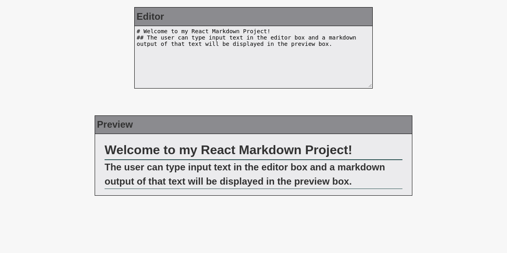

# Markdown Previewer
This application is a markdown previewer web application. The user can type input text in the editor box and a markdown output of that text will be displayed in the preview box.

## Referemces
This application was built using React. It uses Marked to parse and compile the markdown text.

## Webpage
[GitHub Page](https://evanahdout.github.io/markdown-previewer/)

## Preview

